## 1. 实验汇总

本次汇报只保留已完成实验的数据和分析，主要包括四组工作：

| 实验 | 任务 | 训练规模 | 核心结果 |
| --- | --- | ---: | --- |
| HIRO | AntMaze Fixed Collision | 10,000,000 steps | eval1 成功率 0.94，eval2/eval3 未成功 |
| SSE | U-Maze | 786,770 steps | 测试成功率 0.95 |
| SSE | AntKeyChest | 5,002,120 steps | 测试成功率 0.90，评估取钥匙率 1.00 |
| 自设计实验 | Shortcut-Detour | 1,004,007 steps | 测试成功率 0.90 |

## 2. HIRO 复现结果

### 2.1 训练统计

| 指标 | 数值 |
| --- | ---: |
| episodes | 20,000 |
| steps | 10,000,000 |
| first_100_mean return | -7025.509 |
| last_100_mean return | -3903.898 |
| first_500_mean return | -7129.706 |
| last_500_mean return | -4413.232 |
| best episode | episode 217, step 109,000, return -81.725 |
| final episode return | -1655.740 |

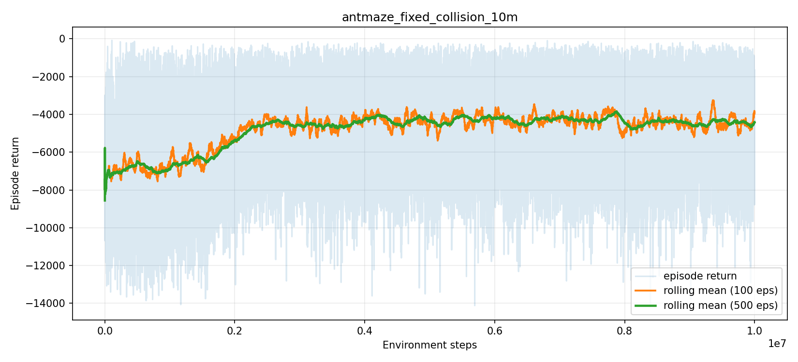

### 2.2 评估结果

最后几个 checkpoint 的 50 episode 评估如下：

| step | eval1 成功率 | eval1 平均距离 | eval2 成功率 | eval2 平均距离 | eval3 成功率 | eval3 平均距离 |
| ---: | ---: | ---: | ---: | ---: | ---: | ---: |
| 9,700,000 | 0.92 | 2.756 | 0.00 | 14.613 | 0.00 | 15.286 |
| 9,800,000 | 0.80 | 2.868 | 0.00 | 13.361 | 0.00 | 15.293 |
| 9,900,000 | 0.86 | 3.126 | 0.00 | 14.143 | 0.00 | 14.975 |
| 10,000,000 | 0.94 | 2.066 | 0.00 | 18.379 | 0.00 | 14.473 |

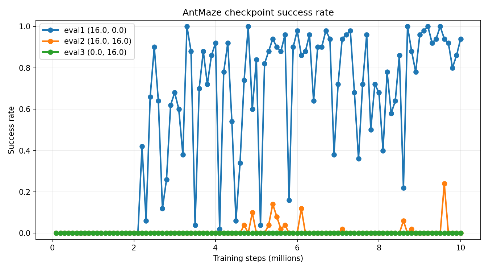

### 2.3 分析

HIRO 的训练 return 有明显改善，说明策略并不是完全失败；最终 episode return 为 -1655.740，相比训练早期的平均 return 有较大提升。

但评估结果显示，成功主要集中在 eval1 目标上，最终 checkpoint 在 eval1 上成功率达到 0.94，而 eval2 和 eval3 仍为 0。这说明 HIRO 在本次复现中学到了部分目标方向上的可执行策略，但泛化到其他目标位置时效果不足。

这个结果可以作为后续 SSE 分析的对照：HIRO 的分层结构有效，但高层子目标和低层执行之间仍可能出现不稳定或目标偏置。

## 3. SSE U-Maze 复现结果

### 3.1 实验数据

| 指标 | 数值 |
| --- | ---: |
| Total Timesteps / env_steps | 786,770 |
| Coverage | 0.659 |
| TestEvn_Dist | 5.399 |
| success_timestep | 307.9 |
| 运行时长 | 约 38,302 秒 |

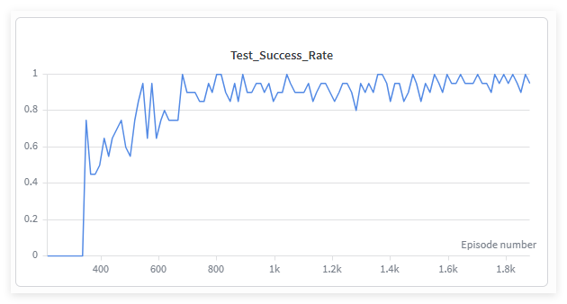

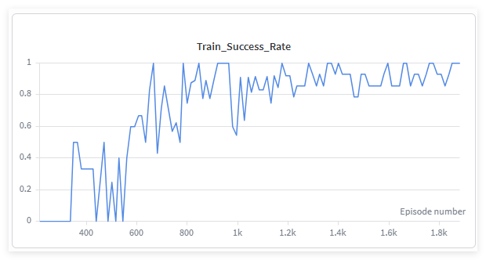

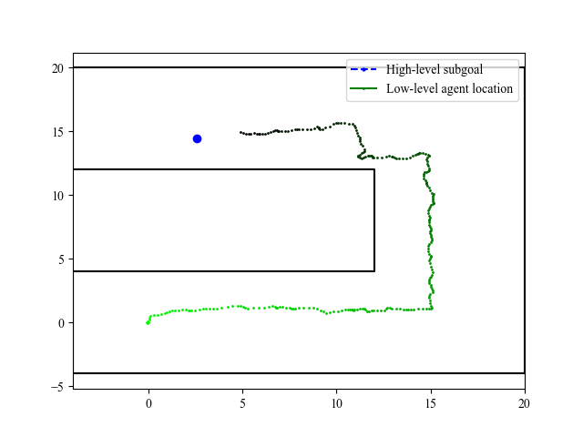

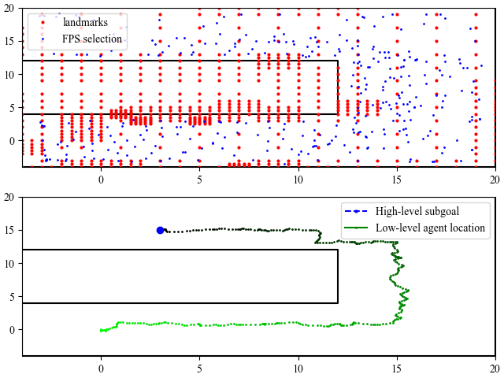

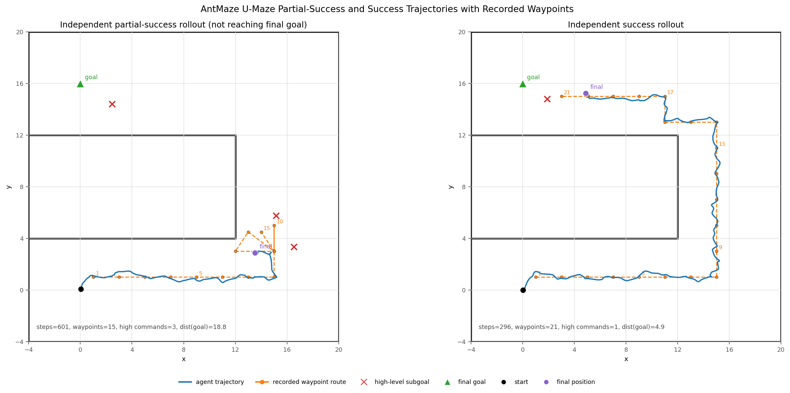

### 3.2 分析

U-Maze 是本次 SSE 复现中最稳定的一组结果。最终测试成功率达到 0.95，训练成功率达到 1.00，说明 SSE 在基础长时序导航任务中可以有效学习到目标到达策略。

从成功率曲线看，测试成功率在早期接近 0，约 300 episode 后开始快速上升，在 500 到 700 episode 之间已经进入 0.7 到 0.95 的区间；约 700 episode 后基本稳定在 0.85 以上，并多次接近或达到 1.0。训练成功率曲线波动更大，前期存在多次回落，说明探索和子目标执行仍不稳定；但约 800 episode 后，大部分训练成功率维持在 0.8 到 1.0 之间，后期趋于稳定。

从轨迹图看，智能体并不是直接沿欧氏距离接近目标，而是沿 U 型通道绕行。这说明图规划和 waypoint 机制参与了决策过程，能够把远距离目标拆成可执行的中间目标。

成功轨迹和部分成功轨迹的对比也能体现 SSE 的关键点：它不仅记录“最终到达哪里”，还强调“高层给出的子目标是否被低层实际完成”。这正是 SSE 相比普通 hindsight relabeling 更严格的地方。

## 4. SSE AntKeyChest 复现结果

### 4.1 实验数据

| 指标 | 数值 |
| --- | ---: |
| Total Timesteps / env_steps | 5,002,120 |
| Coverage | 0.613 |
| TestEvn_Dist | 7.075 |
| success_timestep | 1358.8 |
| has_key_rate_eval | 1.00 |
| has_key_rate_train | 0.929 |
| 运行时长 | 约 273,374 秒 |

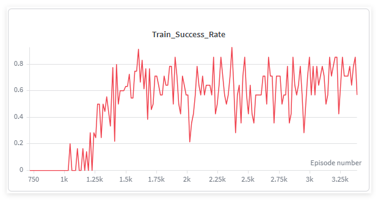

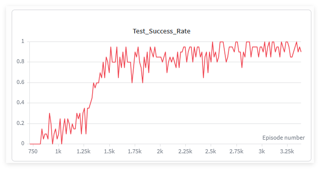

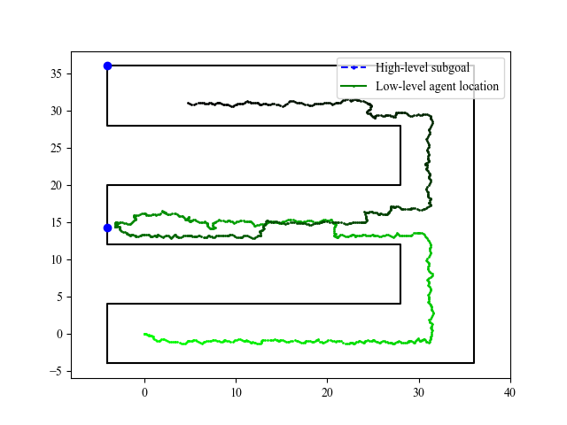

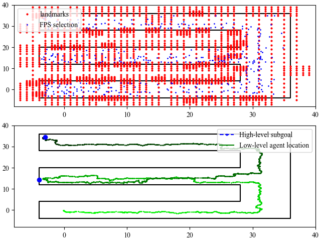

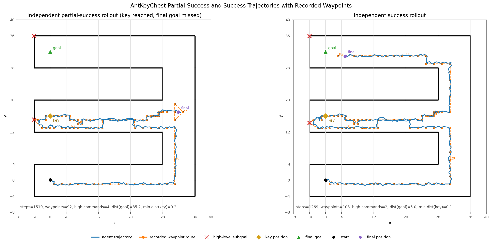

### 4.2 分析

AntKeyChest 比 U-Maze 更复杂，因为任务不仅要求导航到终点，还要求先获得关键中间状态。该实验中测试成功率达到 0.90，评估取钥匙率达到 1.00，说明 SSE 能够在更长的任务链条中学习到关键中间步骤。

与 U-Maze 相比，AntKeyChest 的 success_timestep 从 307.9 增加到 1358.8，运行时间也从约 38,302 秒增加到约 273,374 秒，说明复杂任务显著提高了训练成本。

从成功率曲线看，AntKeyChest 的学习启动明显晚于 U-Maze。训练成功率在约 1000 episode 前基本接近 0，约 1200 episode 后开始快速上升，但之后长期保持较大波动，大致在 0.4 到 0.85 之间震荡。测试成功率也在约 1200 episode 后明显提升，约 1500 episode 后多数维持在 0.75 以上，后期经常接近 0.9 到 1.0。

训练成功率为 0.571，低于测试成功率 0.90，说明训练过程中仍存在较多失败轨迹。这与 AntKeyChest 的任务难度一致：智能体需要先完成取钥匙等关键中间行为，再完成最终目标。但这些失败轨迹对 SSE 并非完全无用，因为失败位置和部分成功信息可以用于修正图中的可达性判断。

## 5. 自设计实验：Shortcut-Detour

### 5.1 实验数据

该实验用于观察路径可靠性：当一条路径更短但更难执行，另一条路径更远但更稳定时，高层规划是否应考虑低层执行反馈。

| 指标 | 数值 |
| --- | ---: |
| Total Timesteps / env_steps | 1,004,007 |
| Coverage | 0.719 |
| TestEvn_Dist | 3.368 |
| success_timestep | 432.6 |
| 运行时长 | 约 43,523 秒 |

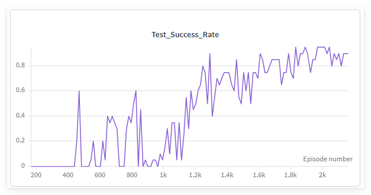

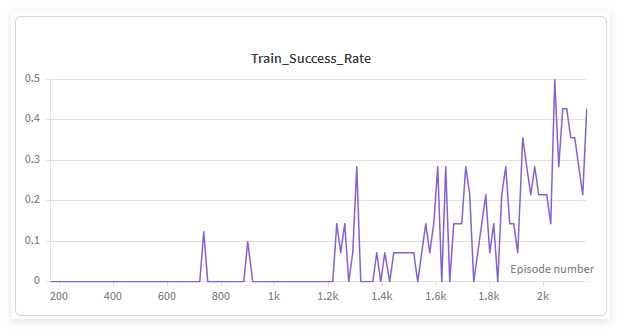

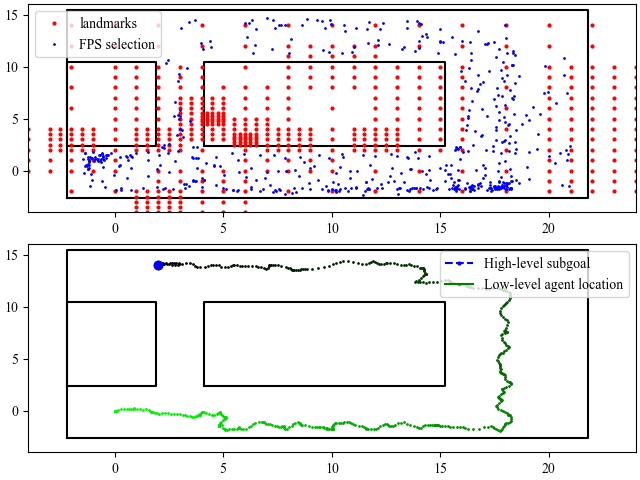

### 5.2 分析

Shortcut-Detour 的测试成功率达到 0.90，说明该任务下策略能够形成可用路径。训练成功率只有 0.429，说明训练过程中仍有较多探索和失败。

从成功率曲线看，测试成功率在 400 episode 前基本为 0，之后开始出现零散成功，但在 900 到 1100 episode 附近仍有明显回落；约 1200 episode 后测试成功率持续上升，后期基本稳定在 0.75 到 0.9 之间。训练成功率整体明显低于测试成功率，直到 1200 episode 之后才开始较频繁出现非零值，后期最高约 0.5，说明训练过程中可靠路径的形成较慢，探索失败仍然很多。

从图结构和轨迹图看，上半部分红色点表示 landmarks，蓝色点表示通过 FPS selection 选出的代表性节点；下半部分绿色轨迹表示低层智能体实际运动轨迹，蓝色虚线表示高层子目标。可以看到，低层轨迹没有直接穿过中间障碍，而是沿外侧绕行到达上方区域，这说明在该任务中，实际可执行路径并不等同于几何最短路径。

这个实验的意义不在于作为标准 benchmark，而在于说明一个机制问题：高层规划不能只看几何最短路径。若较短路径经常执行失败，那么图规划应根据低层执行反馈提高该路径代价，转而选择更可靠的绕行路径。

该实验可以作为 SSE path refinement 思想的补充说明：路径规划的关键不是“最短”，而是“当前低层策略能否稳定执行”。

## 6. 对比分析

| 实验 | 成功表现 | 暴露问题 | 可汇报结论 |
| --- | --- | --- | --- |
| HIRO AntMaze | eval1 最终成功率 0.94 | eval2/eval3 成功率为 0，目标泛化不足 | 分层结构有效，但子目标执行和泛化不稳定 |
| SSE U-Maze | 测试成功率 0.95 | 任务相对基础 | SSE 在基础长时序导航中复现效果较好 |
| SSE AntKeyChest | 测试成功率 0.90，取钥匙率 1.00 | 训练成本高，训练成功率较低 | SSE 可以处理带关键中间状态的复杂任务 |
| Shortcut-Detour | 测试成功率 0.90 | 训练失败样本较多 | 路径可靠性比几何最短距离更重要 |

整体来看，HIRO 和 SSE 都体现了分层强化学习在稀疏奖励长时序任务中的价值。HIRO 可以学习到部分有效策略，但在多目标评估中存在明显偏置；SSE 在 U-Maze 和 AntKeyChest 中表现更稳定，原因在于它显式关注子目标是否可执行，并利用失败信息修正高层规划。

## 7. 汇报结论

1. HIRO 复现完成了 1000 万步 AntMaze Fixed Collision 训练，return 有明显改善，但最终只在 eval1 目标上取得高成功率，说明策略存在目标偏置。
2. SSE 在 U-Maze 上取得 0.95 测试成功率，说明基础长时序导航任务复现成功。
3. SSE 在 AntKeyChest 上取得 0.90 测试成功率和 1.00 评估取钥匙率，说明它能处理更复杂的关键中间状态任务。
4. 自设计 Shortcut-Detour 实验说明，高层规划需要考虑路径可靠性，不能只依据最短距离。
5. 当前结果更适合作为复现与机制分析，而不是严格统计结论；后续若要增强说服力，需要补充更多随机种子和消融实验。
